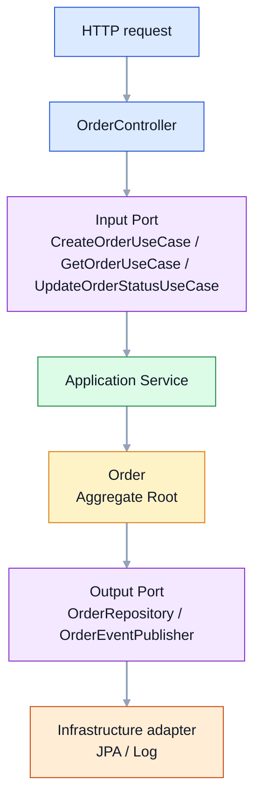
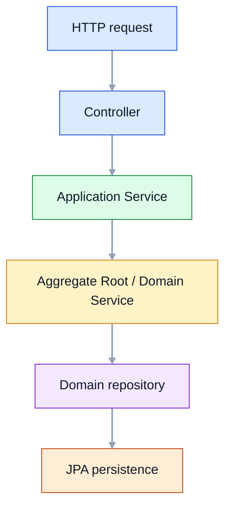
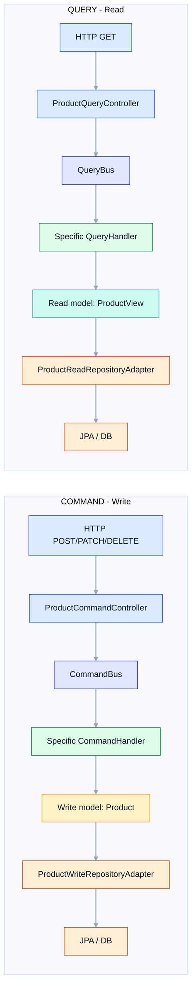
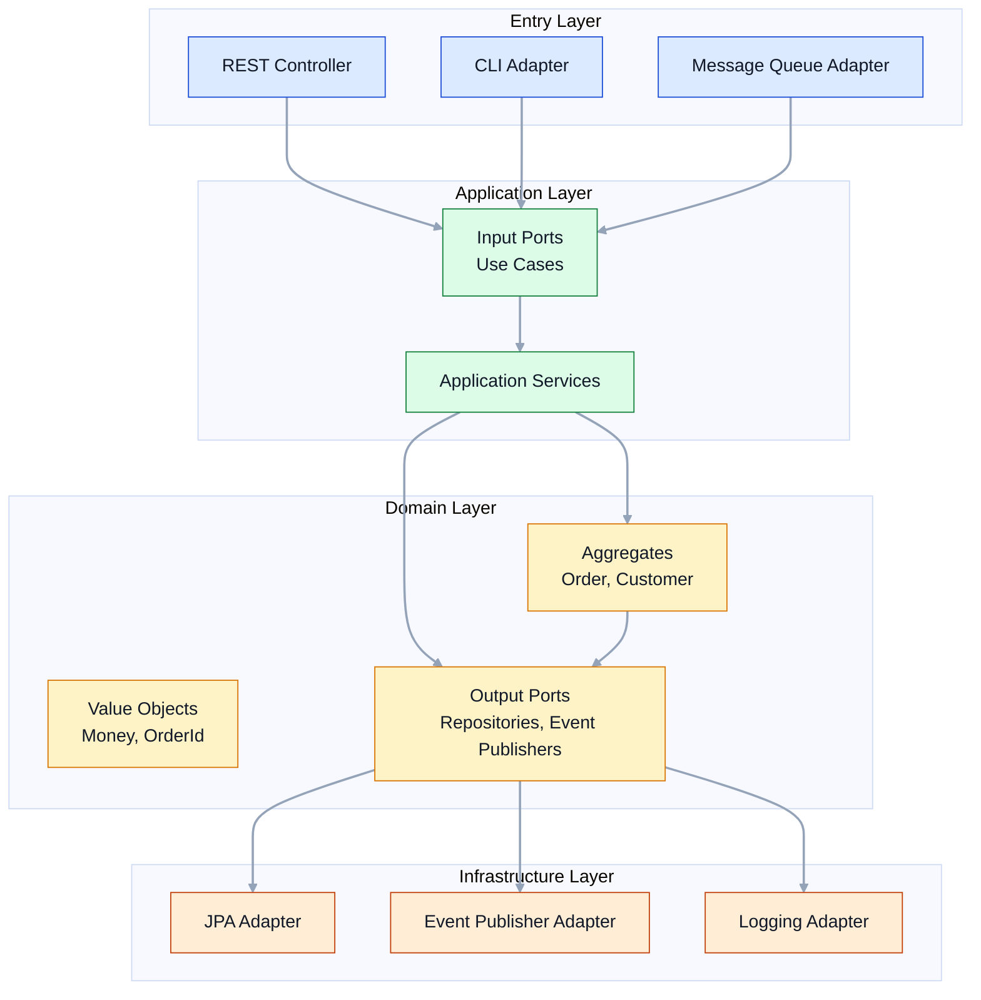
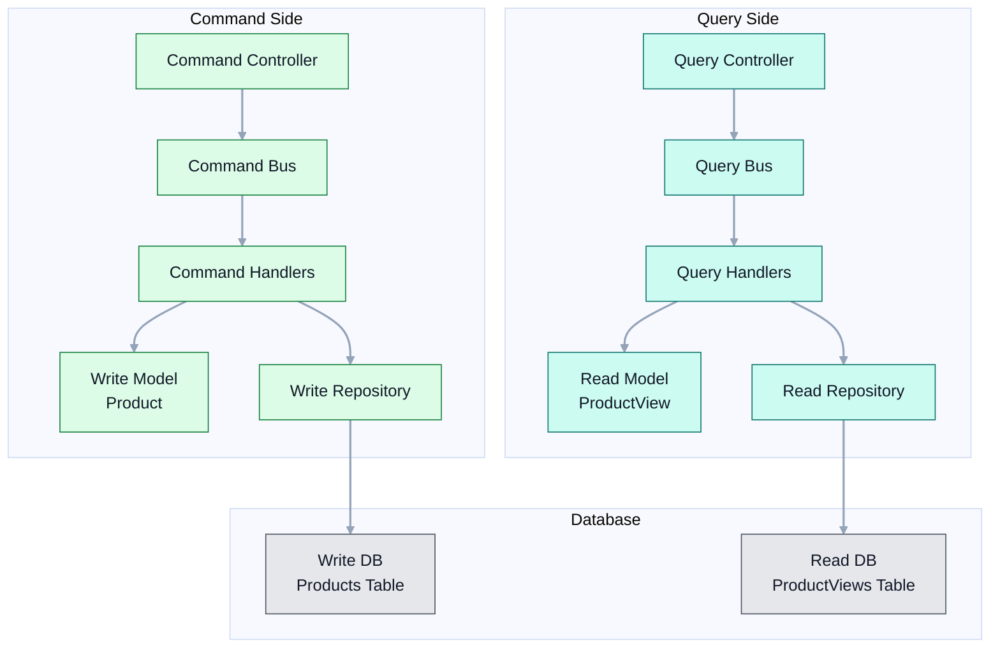
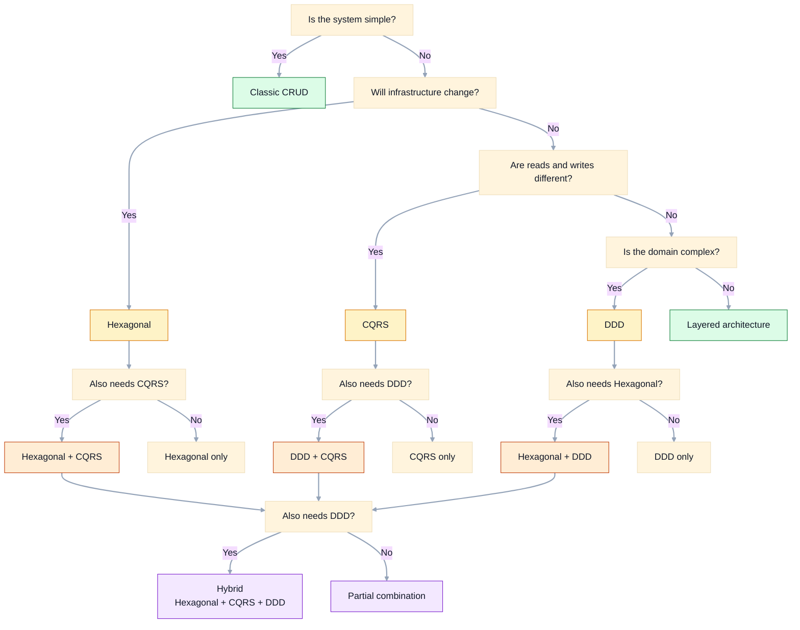
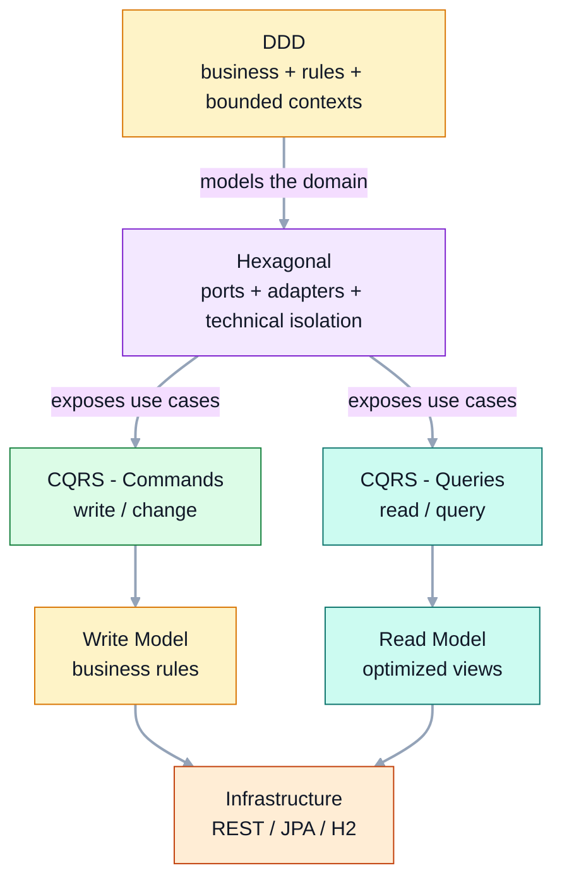

> **Recommended reading order:** Hexagonal → DDD → CQRS → Hybrid
>
> CQRS builds on DDD concepts (rich write model, factory methods, value objects).
> If you read CQRS before DDD, some patterns may feel arbitrary.
> Always start with Hexagonal to understand the foundation, then DDD for domain modeling,
> and finally CQRS for separating reads and writes.

## Hexagonal Architecture

### Core idea

Hexagonal architecture aims for the **system core** to be the domain, with everything else being interchangeable.

The domain should not know whether the app uses REST, queues, JPA, MongoDB or Kafka. That is what **ports** and **adapters** are for:

- **Inbound ports**: what the system exposes to the outside world.
- **Outbound ports**: what the domain needs from the external world.
- **Adapters**: concrete implementations of those ports.

### What is often hard to grasp

1. **The controller does not contain business logic**
   - It only translates HTTP ↔ domain.
   - It does not decide business rules.

2. **Ports live in the domain**
   - They are not “decorative interfaces”.
   - They represent real business needs.

3. **Infrastructure does not rule**
   - JPA, REST, queues, etc. are interchangeable details.

4. **The domain entity encapsulates rules**
   - `Order` protects valid states.
   - It prevents the application from “cheating” with state.

### Visual flow



### Pros

- Very strong domain isolation.
- Easy to test without Spring or a database.
- Changing technology has less impact.
- Clear separation of responsibilities.

### Cons

- More classes and interfaces.
- Can feel “verbose” on small projects.
- Taken to the extreme, it adds too much ceremony.

### When it makes sense

- Systems with real business logic.
- Projects whose infrastructure will change over time.
- Teams that want a clear split between business and technical concerns.
- Applications where the domain must be testable in isolation.

### When it does not

- Simple CRUDs without meaningful rules.
- Throwaway prototypes.
- Very small systems where abstraction cost outweighs the benefit.

## DDD

### Core idea

DDD is not a “pretty” layered architecture; it is a way to model software around the **business language**.

Instead of thinking first about tables or endpoints, you think about:

- what the business wants to do,
- what its rules are,
- which concepts matter,
- and how they group together.

### What is often hard to grasp

1. **Bounded Context**
   - The same term can mean different things depending on context.
   - That is why `account` and `customer` exist as separate contexts.

2. **Aggregate Root**
   - It guards invariants.
   - In this repo, `Account` decides whether deposits, withdrawals or transfers are allowed.

3. **Value Objects**
   - They have no identity of their own, only value.
   - `Money`, `AccountId`, `CustomerId` are perfect examples.

4. **Domain Service**
   - Used when logic does not clearly belong to a single aggregate.
   - `TransferDomainService` coordinates a transfer between accounts.

5. **Domain Events**
   - Facts that happened in the domain.
   - They decouple follow-up reactions.

### Visual flow



### Pros

- Excellent for domains with complex rules.
- Encourages a shared business–technology language.
- Makes system boundaries visible.
- Invariants live where they should: in the domain.

### Cons

- Requires a solid understanding of the business.
- Can feel like over-engineering if the domain is simple.
- It does not automatically give you a technical solution; it demands judgment.
- Applied poorly, it becomes pure “pattern decoration”.

### When it makes sense

- Complex or changing domains.
- Systems with important business rules.
- Products where business understanding is key.
- Teams that want a robust, evolvable foundation.

### When it does not

- Trivial CRUDs.
- Short-lived applications.
- When there is no real business complexity.
- When the team cannot yet sustain the conceptual cost.

## CQRS

### Core idea

CQRS separates **who writes** from **who reads**.

The point is not “putting two different folders”, but accepting that reads and writes usually have very different needs:

- When writing, rules, validation and invariants matter.
- When reading, speed, filters and query shapes matter.

### What is often hard to grasp

1. **A command does not return read data**
   - A command expresses intent to change state.
   - It should not be used as a disguised query.

2. **The read model does not have to match the write model**
   - `Product` protects writes.
   - `ProductView` optimizes reads.

3. **The split is not only conceptual**
   - Here there are distinct APIs:
     - `/api/commands/products`
     - `/api/queries/products`

4. **Buses decouple transport**
   - `CommandBus` and `QueryBus` keep the controller from knowing concrete handlers.

### Visual flow



### Pros

- Very clear for systems with far more reads than writes.
- Lets you optimize queries independently.
- Makes the read model easier to evolve.
- Can improve scalability and performance.

### Cons

- More complexity than a classic CRUD.
- Can duplicate logic or structures.
- On a small domain, it can feel excessive.
- Consistency between writes and reads requires discipline.

### When it makes sense

- Products with heavy read traffic.
- Dashboards, catalogs and panels.
- Systems where the read model must differ from the write model.
- Domains with very uneven read/write load.

### When it does not

- Simple CRUDs.
- Systems with minimal business rules.
- Teams that do not yet master the base architecture.
- Projects where separating reads and writes brings no real benefit.

## When to combine architectures

These architectures do not compete with each other; they often complement each other very well.

### Hexagonal + DDD

**When:** almost always when the domain has real weight.

**What the combination adds:**

- DDD tells you **how to model the business**.
- Hexagonal tells you **how to protect that model from the outside world**.

**Real project benefit:**

- the aggregate does not depend on Spring,
- use cases become explicit,
- and technical adapters stay outside the core.

**Typical outcome:** strong domain, interchangeable infrastructure.

### Hexagonal + CQRS

**When:** when reads and writes start to take very different shapes.

**What the combination adds:**

- Hexagonal separates the system from technical details.
- CQRS separates write behavior from read behavior.

**Real project benefit:**

- you can have a rich write model and a simple read model,
- keep the controller from knowing about persistence,
- and optimize queries without polluting the domain.

**Typical outcome:** clearer APIs and better read scaling.

### DDD + CQRS

**When:** in complex domains that also have heavy read traffic.

**What the combination adds:**

- DDD models writes well.
- CQRS allows a read model tailored to each use case.

**Real project benefit:**

- small, clear aggregates,
- fast, specific queries,
- ability to evolve reads and writes separately.

**Typical outcome:** rich domain with highly efficient reads.

### All three together: Hexagonal + DDD + CQRS

**When:** serious systems with expected evolution and enough complexity.

**What the combination adds:**

- **DDD** defines language and rules.
- **Hexagonal** protects the domain from technology.
- **CQRS** optimizes the read/write experience.

**Real project benefit:**

- more maintainable code over the long term,
- better modeled business,
- interchangeable adapters,
- efficient queries,
- and a highly testable domain core.

**But beware:** do not use all three because it is fashionable. The combination only makes sense when the problem justifies it.

## Practical rule for choosing

- **If the system is small and simple** → a well-built CRUD is probably enough.
- **If the domain matters and infrastructure may change** → Hexagonal.
- **If reads and writes are clearly different** → CQRS.
- **If there are complex business rules and business vocabulary matters** → DDD.
- **If the system is complex and also needs optimized reads** → combine Hexagonal + DDD + CQRS.

## Example APIs

### Hexagonal — Orders

```bash
# Create order
curl -X POST http://localhost:8081/api/orders \
  -H "Content-Type: application/json" \
  -d '{"customerId":"CUST-1","items":[{"productId":"P1","productName":"Laptop","price":1200.00,"quantity":2}]}'

# Get order
curl http://localhost:8081/api/orders/{id}

# Confirm order
curl -X PATCH http://localhost:8081/api/orders/{id}/confirm
```

### CQRS — Products

```bash
# Create product (COMMAND)
curl -X POST http://localhost:8082/api/commands/products \
  -H "Content-Type: application/json" \
  -d '{"name":"MacBook Pro","description":"Apple laptop","price":2500.00,"stock":10}'

# List products (QUERY)
curl http://localhost:8082/api/queries/products

# Update price (COMMAND)
curl -X PATCH http://localhost:8082/api/commands/products/{id}/price \
  -H "Content-Type: application/json" \
  -d '{"newPrice":2300.00}'
```

### DDD — Bank accounts

```bash
# Open account
curl -X POST http://localhost:8083/api/accounts \
  -H "Content-Type: application/json" \
  -d '{"ownerId":"CUST-1","ownerName":"Alice","initialDeposit":500.00}'

# Deposit money
curl -X POST http://localhost:8083/api/accounts/{id}/deposit \
  -H "Content-Type: application/json" \
  -d '{"amount":200.00}'

# Transfer money
curl -X POST http://localhost:8083/api/accounts/{fromId}/transfer \
  -H "Content-Type: application/json" \
  -d '{"toAccountId":"{toId}","amount":100.00}'
```

### Hybrid — Subscriptions combining Hexagonal + CQRS + DDD

```bash
# Create subscription (command side)
curl -X POST http://localhost:8084/api/commands/subscriptions \
  -H "Content-Type: application/json" \
  -d '{"customerId":"CUST-1","planCode":"PRO","monthlyFee":29.99}'

# Activate subscription (command side)
curl -X PATCH http://localhost:8084/api/commands/subscriptions/{subscriptionId}/activate

# Get a subscription (query side)
curl http://localhost:8084/api/queries/subscriptions/{subscriptionId}

# List active subscriptions (query side)
curl http://localhost:8084/api/queries/subscriptions
```

### What does this combination bring to a real project?

- The **business model** stays clean and protected.
- **Queries** can be optimized without touching writes.
- **Infrastructure** can change with little impact on the core.
- Every part of the system has a clear reason to exist.

## Architecture diagrams

### Hexagonal architecture — components



### CQRS architecture — components



### Architecture comparison

| Aspect | Hexagonal | CQRS | DDD | Hybrid |
| --- | --- | --- | --- | --- |
| **Main focus** | Domain isolation | Read/write separation | Business language | Combination of all three |
| **Complexity** | Medium | Medium–High | High | Very high |
| **Learning curve** | Moderate | Moderate | High | Very high |
| **Ideal for** | Domains with variable infrastructure | Read-heavy systems | Complex domains | Serious, evolvable systems |
| **Not ideal for** | Simple CRUDs | Simple CRUDs | Simple domains | Prototypes |
| **Key components** | Ports, Adapters, Aggregates | Commands, Queries, Buses | Bounded Contexts, Ubiquitous Language | All of the above |
| **Testing** | Easy (isolated domain) | Easy (separated) | Easy (rich domain) | Easy but verbose |
| **Scalability** | Good | Very good (reads) | Good | Excellent |

### Decision diagram



### Visual diagram of the combination


