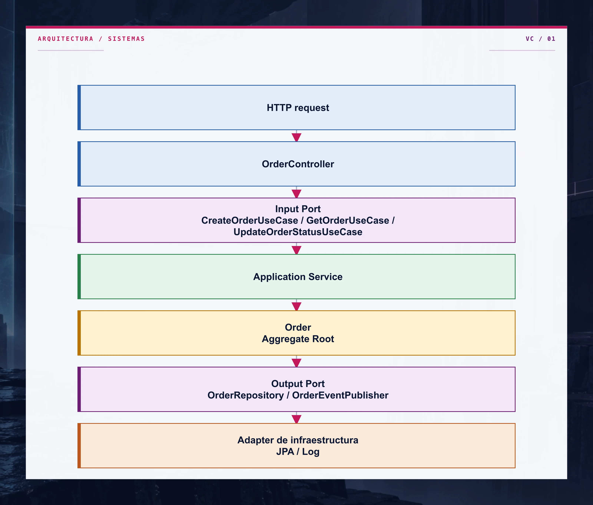
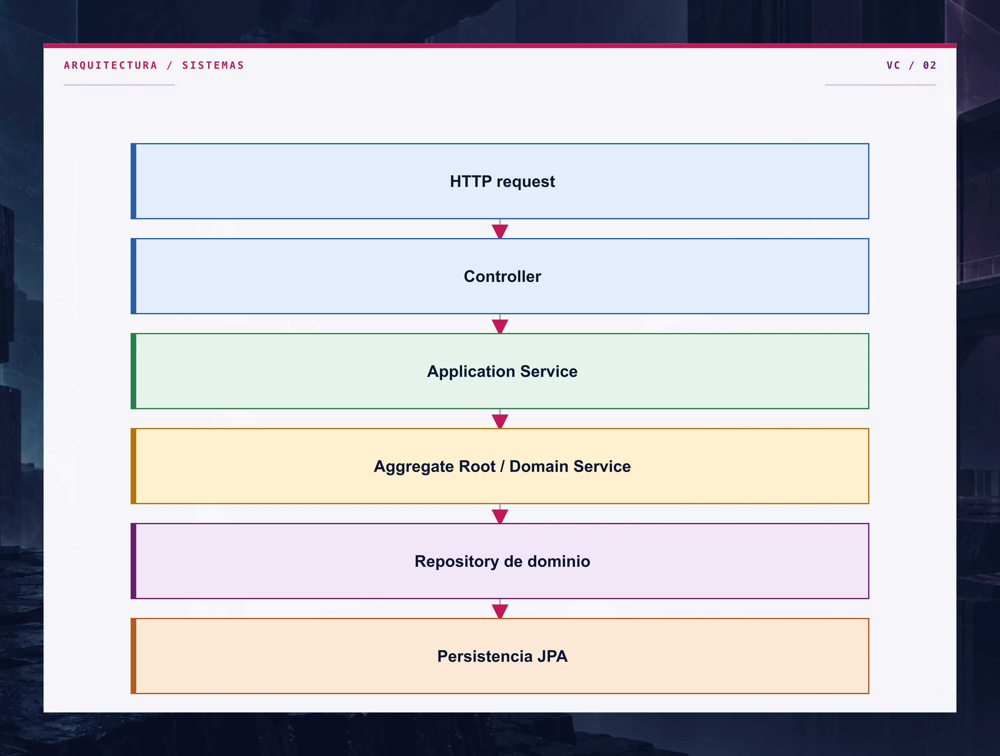
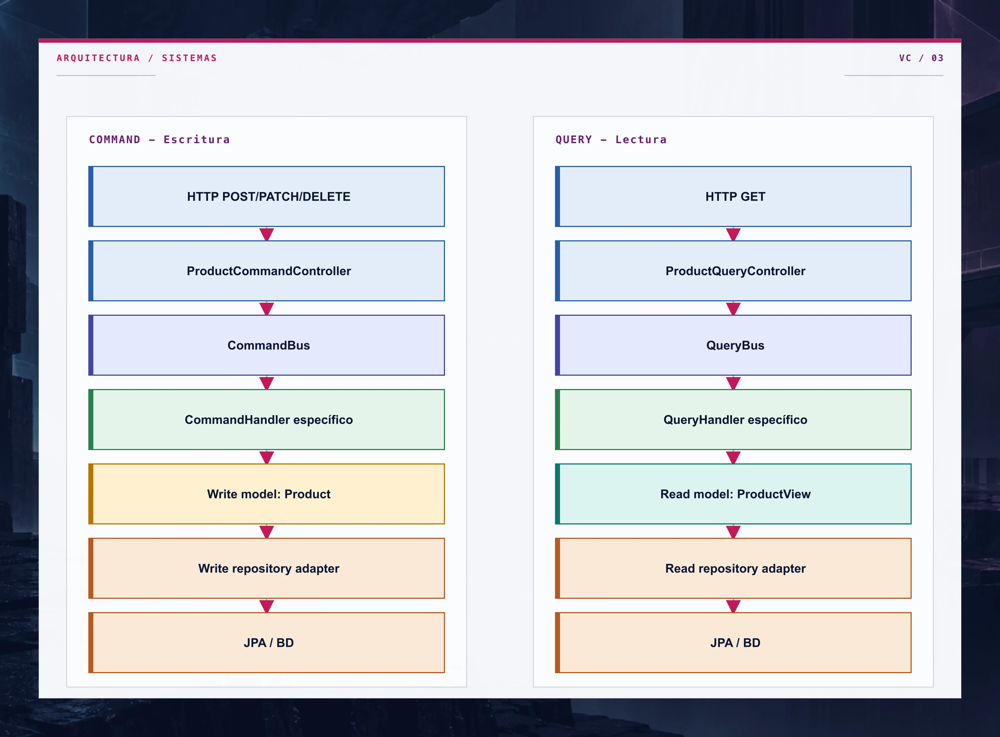
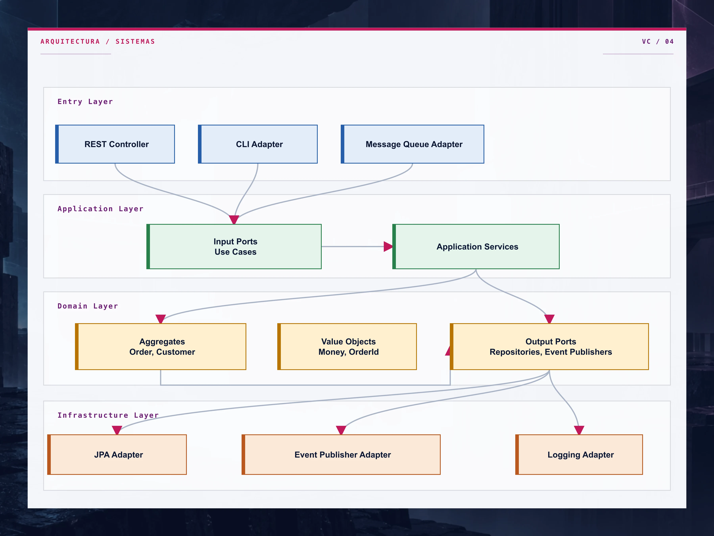
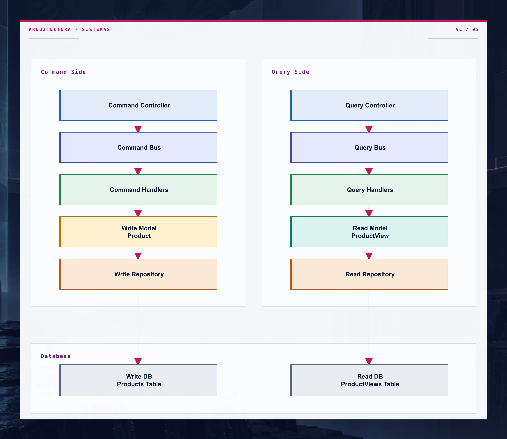
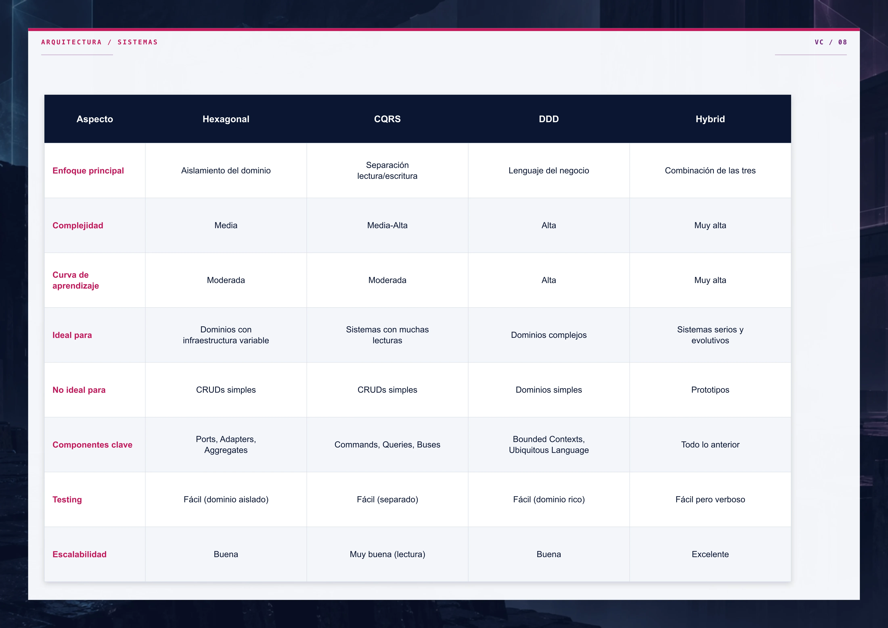
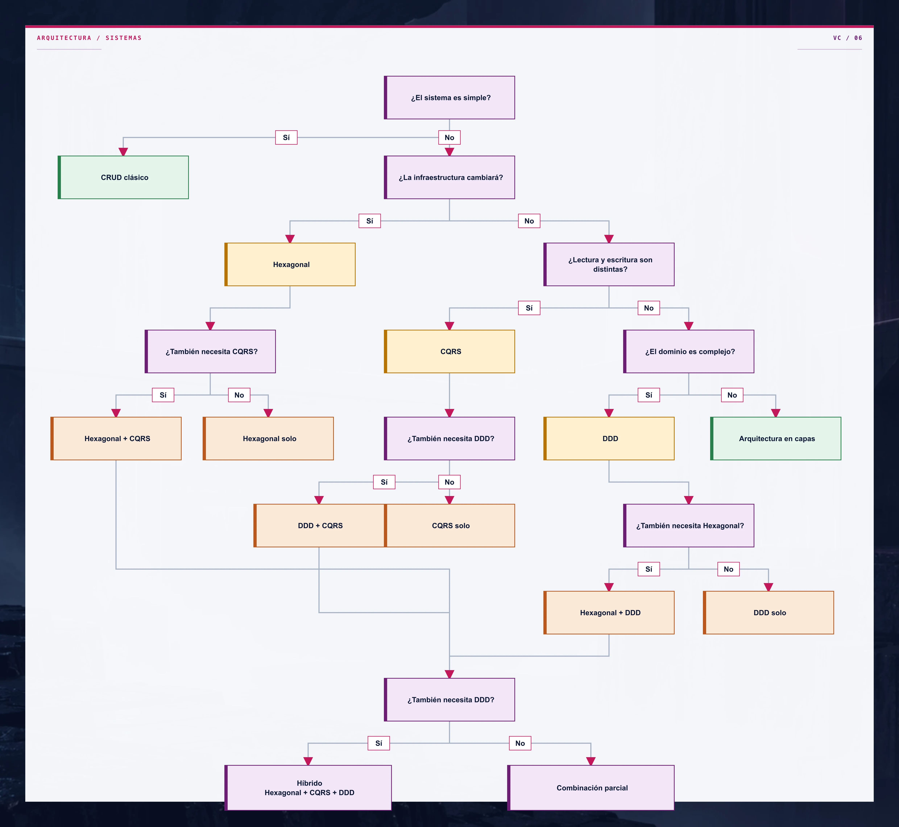
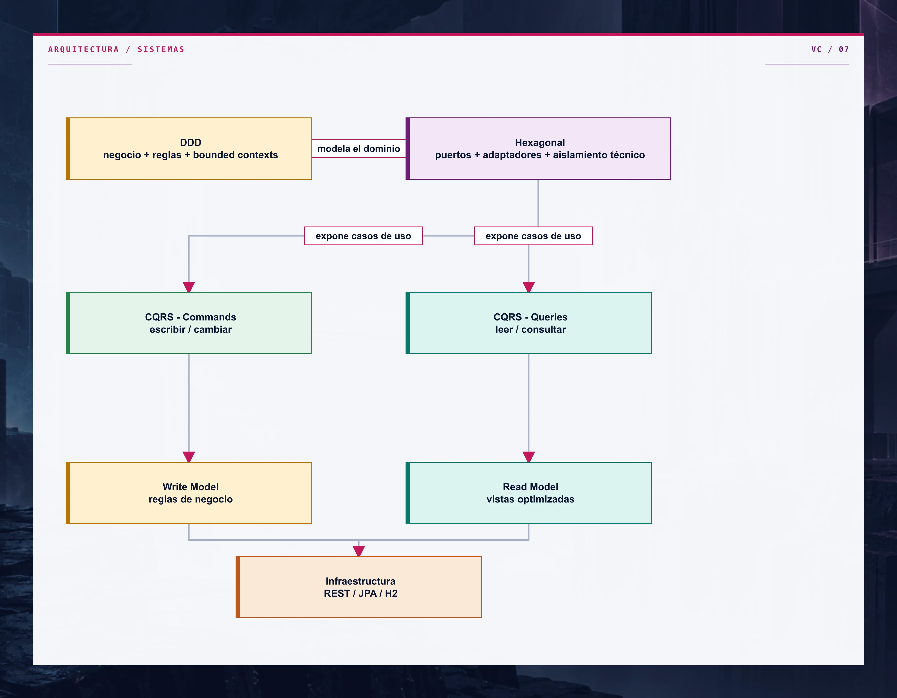

> **Orden de lectura recomendado:** Hexagonal → DDD → CQRS → Hybrid
>
> CQRS utiliza conceptos de DDD (write model rico, factory methods, value objects).
> Si lees CQRS antes que DDD, algunos patrones pueden parecer arbitrarios.
> Empieza siempre por Hexagonal para entender la base, luego DDD para el modelado del dominio,
> y finalmente CQRS para la separación de lectura y escritura.

## Hexagonal Architecture

### Idea principal

La arquitectura hexagonal busca que el **núcleo del sistema** sea el dominio y que todo lo demás sea intercambiable.

El dominio no debería saber si la app usa REST, colas, JPA, MongoDB o Kafka. Para eso existen los **puertos** y **adaptadores**:

- **Puertos de entrada**: lo que el sistema ofrece al exterior.
- **Puertos de salida**: lo que el dominio necesita del mundo externo.
- **Adaptadores**: implementaciones concretas de esos puertos.

### Lo que suele costar entender

1. **El controlador no contiene negocio**
   - Solo traduce HTTP ↔ dominio.
   - No decide reglas de negocio.

2. **Los puertos viven en el dominio**
   - No son “interfaces decorativas”.
   - Representan necesidades reales del negocio.

3. **La infraestructura no manda**
   - JPA, REST, colas, etc. son detalles intercambiables.

4. **La entidad de dominio encapsula reglas**
   - `Order` protege estados válidos.
   - Evita que la aplicación “haga trampas” con el estado.

### Flujo visual



<details>
<summary>Datos accesibles del diagrama</summary>
<p><strong>Nodos</strong></p><ul><li><strong>A</strong> — HTTP request</li><li><strong>B</strong> — OrderController</li><li><strong>C</strong> — Input Port / CreateOrderUseCase / GetOrderUseCase / / UpdateOrderStatusUseCase</li><li><strong>D</strong> — Application Service</li><li><strong>E</strong> — Order / Aggregate Root</li><li><strong>F</strong> — Output Port / OrderRepository / OrderEventPublisher</li><li><strong>G</strong> — Adapter de infraestructura / JPA / Log</li></ul><p><strong>Conexiones</strong></p><ul><li><strong>A</strong> (HTTP request) → <strong>B</strong> (OrderController)</li><li><strong>B</strong> (OrderController) → <strong>C</strong> (Input Port / CreateOrderUseCase / GetOrderUseCase / / UpdateOrderStatusUseCase)</li><li><strong>C</strong> (Input Port / CreateOrderUseCase / GetOrderUseCase / / UpdateOrderStatusUseCase) → <strong>D</strong> (Application Service)</li><li><strong>D</strong> (Application Service) → <strong>E</strong> (Order / Aggregate Root)</li><li><strong>E</strong> (Order / Aggregate Root) → <strong>F</strong> (Output Port / OrderRepository / OrderEventPublisher)</li><li><strong>F</strong> (Output Port / OrderRepository / OrderEventPublisher) → <strong>G</strong> (Adapter de infraestructura / JPA / Log)</li></ul>
</details>

### Pros

- Muy buen aislamiento del dominio.
- Fácil de probar sin Spring ni BD.
- Cambiar tecnología tiene menos impacto.
- Claridad de responsabilidades.

### Contras

- Más clases e interfaces.
- Puede parecer “verbosa” en proyectos pequeños.
- Si se lleva al extremo, añade demasiada ceremonia.

### Cuándo interesa usarla

- Sistemas con lógica de negocio real.
- Proyectos que cambiarán de infraestructura con el tiempo.
- Equipos que quieren separar bien negocio y técnica.
- Aplicaciones donde el dominio debe ser testeable de forma aislada.

### Cuándo no conviene

- CRUDs simples sin reglas relevantes.
- Prototipos desechables.
- Sistemas muy pequeños donde el coste de abstracción supera el beneficio.

## DDD

### Idea principal

DDD no es una arquitectura de capas "bonita"; es una forma de modelar el software alrededor del **lenguaje del negocio**.

En lugar de pensar primero en tablas o endpoints, se piensa en:

- qué quiere hacer el negocio,
- cuáles son sus reglas,
- qué conceptos son importantes,
- y cómo se agrupan.

### Lo que suele costar entender

1. **Bounded Context**
   - Un mismo término puede significar cosas distintas según el contexto.
   - Por eso existen `account` y `customer` como contextos separados.

2. **Aggregate Root**
   - Es el guardián de las invariantes.
   - En este repo, `Account` decide si se puede depositar, retirar o transferir.

3. **Value Objects**
   - No tienen identidad propia, solo valor.
   - `Money`, `AccountId`, `CustomerId` son ejemplos perfectos.

4. **Domain Service**
   - Se usa cuando la lógica no pertenece claramente a un solo aggregate.
   - `TransferDomainService` coordina una transferencia entre cuentas.

5. **Domain Events**
   - Son hechos que ocurrieron en el dominio.
   - Permiten desacoplar reacciones posteriores.

### Flujo visual



<details>
<summary>Datos accesibles del diagrama</summary>
<p><strong>Nodos</strong></p><ul><li><strong>A</strong> — HTTP request</li><li><strong>B</strong> — Controller</li><li><strong>C</strong> — Application Service</li><li><strong>D</strong> — Aggregate Root / Domain Service</li><li><strong>E</strong> — Repository de dominio</li><li><strong>F</strong> — Persistencia JPA</li></ul><p><strong>Conexiones</strong></p><ul><li><strong>A</strong> (HTTP request) → <strong>B</strong> (Controller)</li><li><strong>B</strong> (Controller) → <strong>C</strong> (Application Service)</li><li><strong>C</strong> (Application Service) → <strong>D</strong> (Aggregate Root / Domain Service)</li><li><strong>D</strong> (Aggregate Root / Domain Service) → <strong>E</strong> (Repository de dominio)</li><li><strong>E</strong> (Repository de dominio) → <strong>F</strong> (Persistencia JPA)</li></ul>
</details>

### Pros

- Excelente para dominios con reglas complejas.
- Favorece lenguaje común negocio-tecnología.
- Hace visibles los límites del sistema.
- Los invariantes viven donde deben vivir: en el dominio.

### Contras

- Requiere entender bien el negocio.
- Puede parecer sobreingeniería si el dominio es simple.
- No te da automáticamente una solución técnica; exige criterio.
- Si se aplica mal, se convierte en puro "patrón decorativo".

### Cuándo interesa usarlo

- Dominios complejos o cambiantes.
- Sistemas con reglas de negocio importantes.
- Productos donde la comprensión del negocio es clave.
- Equipos que quieren una base robusta y evolutiva.

### Cuándo no conviene

- CRUDs triviales.
- Aplicaciones de poca vida útil.
- Cuando no existe complejidad de negocio real.
- Cuando el equipo aún no puede sostener el coste conceptual.

## CQRS

### Idea principal

CQRS separa **quién escribe** de **quién consulta**.

La idea no es "poner dos carpetas diferentes", sino aceptar que leer y escribir suelen tener necesidades muy distintas:

- Al escribir, importan reglas, validación e invariantes.
- Al leer, importan rapidez, filtros y formatos de consulta.

### Lo que suele costar entender

1. **Command no devuelve datos de lectura**
   - Un command expresa intención de cambio.
   - No debería usarse como query disfrazada.

2. **Read model no tiene por qué ser igual al write model**
   - `Product` protege la escritura.
   - `ProductView` optimiza la consulta.

3. **La separación no es solo conceptual**
   - Aquí hay APIs distintas:
     - `/api/commands/products`
     - `/api/queries/products`

4. **Los buses desacoplan el transporte**
   - `CommandBus` y `QueryBus` evitan que el controlador conozca handlers concretos.

### Flujo visual



<details>
<summary>Datos accesibles del diagrama</summary>
<p><strong>Grupos</strong></p><ul><li>COMMAND - Escritura</li><li>QUERY - Lectura</li></ul><p><strong>Nodos</strong></p><ul><li><strong>C1</strong> — HTTP POST/PATCH/DELETE</li><li><strong>C2</strong> — ProductCommandController</li><li><strong>C3</strong> — CommandBus</li><li><strong>C4</strong> — CommandHandler específico</li><li><strong>C5</strong> — Write model: Product</li><li><strong>C6</strong> — ProductWriteRepositoryAdapter</li><li><strong>C7</strong> — JPA / BD</li><li><strong>Q1</strong> — HTTP GET</li><li><strong>Q2</strong> — ProductQueryController</li><li><strong>Q3</strong> — QueryBus</li><li><strong>Q4</strong> — QueryHandler específico</li><li><strong>Q5</strong> — Read model: ProductView</li><li><strong>Q6</strong> — ProductReadRepositoryAdapter</li><li><strong>Q7</strong> — JPA / BD</li></ul><p><strong>Conexiones</strong></p><ul><li><strong>C1</strong> (HTTP POST/PATCH/DELETE) → <strong>C2</strong> (ProductCommandController)</li><li><strong>C2</strong> (ProductCommandController) → <strong>C3</strong> (CommandBus)</li><li><strong>C3</strong> (CommandBus) → <strong>C4</strong> (CommandHandler específico)</li><li><strong>C4</strong> (CommandHandler específico) → <strong>C5</strong> (Write model: Product)</li><li><strong>C5</strong> (Write model: Product) → <strong>C6</strong> (ProductWriteRepositoryAdapter)</li><li><strong>C6</strong> (ProductWriteRepositoryAdapter) → <strong>C7</strong> (JPA / BD)</li><li><strong>Q1</strong> (HTTP GET) → <strong>Q2</strong> (ProductQueryController)</li><li><strong>Q2</strong> (ProductQueryController) → <strong>Q3</strong> (QueryBus)</li><li><strong>Q3</strong> (QueryBus) → <strong>Q4</strong> (QueryHandler específico)</li><li><strong>Q4</strong> (QueryHandler específico) → <strong>Q5</strong> (Read model: ProductView)</li><li><strong>Q5</strong> (Read model: ProductView) → <strong>Q6</strong> (ProductReadRepositoryAdapter)</li><li><strong>Q6</strong> (ProductReadRepositoryAdapter) → <strong>Q7</strong> (JPA / BD)</li></ul>
</details>

### Pros

- Muy claro para sistemas con muchas más lecturas que escrituras.
- Permite optimizar consultas de forma independiente.
- Hace más fácil evolucionar el read model.
- Puede mejorar escalabilidad y rendimiento.

### Contras

- Más complejidad que un CRUD clásico.
- Puede duplicar lógica o estructuras.
- Si el dominio es pequeño, puede sentirse excesivo.
- La consistencia entre escritura y lectura requiere disciplina.

### Cuándo interesa usarlo

- Productos con muchas consultas.
- Paneles, catálogos y dashboards.
- Sistemas donde el modelo de lectura necesita ser distinto del de escritura.
- Dominios donde la carga de lectura y escritura es muy desigual.

### Cuándo no conviene

- CRUDs sencillos.
- Sistemas con reglas de negocio mínimas.
- Equipos que aún no dominan bien la arquitectura base.
- Proyectos donde separar lectura/escritura no aporta un beneficio real.


## Cuándo mezclar arquitecturas

Estas arquitecturas no compiten entre sí; muchas veces se complementan muy bien.

### Hexagonal + DDD

**Cuándo:** casi siempre que el dominio tenga peso real.

**Qué aporta la mezcla:**

- DDD te dice **cómo modelar el negocio**.
- Hexagonal te dice **cómo proteger ese modelo del mundo exterior**.

**Beneficio real en un proyecto:**

- el aggregate no depende de Spring,
- los casos de uso se vuelven explícitos,
- y los adaptadores técnicos quedan fuera del núcleo.

**Resultado típico:** dominio fuerte, infraestructura intercambiable.

### Hexagonal + CQRS

**Cuándo:** cuando escribir y leer empiezan a tener formas muy distintas.

**Qué aporta la mezcla:**

- Hexagonal separa el sistema de los detalles técnicos.
- CQRS separa el comportamiento de escritura del de lectura.

**Beneficio real en un proyecto:**

- puedes tener un write model rico y un read model simple,
- evitar que el controlador conozca la persistencia,
- y optimizar queries sin ensuciar el dominio.

**Resultado típico:** APIs más claras y mejor escalado de lectura.

### DDD + CQRS

**Cuándo:** en dominios complejos donde además hay muchas consultas.

**Qué aporta la mezcla:**

- DDD modela bien la escritura.
- CQRS permite un read model adaptado a cada caso de uso.

**Beneficio real en un proyecto:**

- aggregates pequeños y claros,
- consultas rápidas y específicas,
- posibilidad de evolucionar lectura/escritura por separado.

**Resultado típico:** dominio rico con lecturas muy eficientes.

### Las tres juntas: Hexagonal + DDD + CQRS

**Cuándo:** sistemas serios, con evolución prevista y suficiente complejidad.

**Qué aporta la combinación:**

- **DDD** define el lenguaje y las reglas.
- **Hexagonal** protege el dominio de la tecnología.
- **CQRS** optimiza la experiencia de lectura/escritura.

**Beneficio real en un proyecto:**

- código más mantenible a largo plazo,
- negocio mejor modelado,
- adaptadores intercambiables,
- consultas eficientes,
- y un núcleo de dominio muy testable.

**Pero ojo:** no hay que usar las tres por moda. La combinación solo tiene sentido cuando el problema lo justifica.

## Regla práctica para elegir

- **Si el sistema es pequeño y simple** → probablemente un CRUD bien hecho sea suficiente.
- **Si el dominio importa y la infraestructura puede cambiar** → Hexagonal.
- **Si la escritura y la lectura son claramente distintas** → CQRS.
- **Si hay reglas de negocio complejas y vocabulario del negocio importante** → DDD.
- **Si el sistema es complejo y además necesita lectura optimizada** → combinar Hexagonal + DDD + CQRS.

## APIs de ejemplo

### Hexagonal - Pedidos

```bash
# Crear pedido
curl -X POST http://localhost:8081/api/orders \
  -H "Content-Type: application/json" \
  -d '{"customerId":"CUST-1","items":[{"productId":"P1","productName":"Laptop","price":1200.00,"quantity":2}]}'

# Consultar pedido
curl http://localhost:8081/api/orders/{id}

# Confirmar pedido
curl -X PATCH http://localhost:8081/api/orders/{id}/confirm
```

### CQRS - Productos

```bash
# Crear producto (COMMAND)
curl -X POST http://localhost:8082/api/commands/products \
  -H "Content-Type: application/json" \
  -d '{"name":"MacBook Pro","description":"Laptop Apple","price":2500.00,"stock":10}'

# Listar productos (QUERY)
curl http://localhost:8082/api/queries/products

# Actualizar precio (COMMAND)
curl -X PATCH http://localhost:8082/api/commands/products/{id}/price \
  -H "Content-Type: application/json" \
  -d '{"newPrice":2300.00}'
```

### DDD - Cuentas bancarias

```bash
# Abrir cuenta
curl -X POST http://localhost:8083/api/accounts \
  -H "Content-Type: application/json" \
  -d '{"ownerId":"CUST-1","ownerName":"Alice","initialDeposit":500.00}'

# Depositar dinero
curl -X POST http://localhost:8083/api/accounts/{id}/deposit \
  -H "Content-Type: application/json" \
  -d '{"amount":200.00}'

# Transferir dinero
curl -X POST http://localhost:8083/api/accounts/{fromId}/transfer \
  -H "Content-Type: application/json" \
  -d '{"toAccountId":"{toId}","amount":100.00}'
```

### Hybrid - Suscripciones combinando Hexagonal + CQRS + DDD

```bash
# Crear suscripción (command side)
curl -X POST http://localhost:8084/api/commands/subscriptions \
  -H "Content-Type: application/json" \
  -d '{"customerId":"CUST-1","planCode":"PRO","monthlyFee":29.99}'

# Activar suscripción (command side)
curl -X PATCH http://localhost:8084/api/commands/subscriptions/{subscriptionId}/activate

# Consultar una suscripción (query side)
curl http://localhost:8084/api/queries/subscriptions/{subscriptionId}

# Ver suscripciones activas (query side)
curl http://localhost:8084/api/queries/subscriptions
```

### ¿Qué aporta esta mezcla en un proyecto real?

- El **modelo de negocio** queda limpio y protegido.
- Las **consultas** pueden optimizarse sin tocar la escritura.
- La **infraestructura** puede cambiar con poco impacto en el núcleo.
- Cada parte del sistema tiene una razón clara de existir.

## Diagramas de Arquitectura

### Arquitectura Hexagonal - Componentes



<details>
<summary>Datos accesibles del diagrama</summary>
<p><strong>Grupos</strong></p><ul><li>Entry Layer</li><li>Application Layer</li><li>Domain Layer</li><li>Infrastructure Layer</li></ul><p><strong>Nodos</strong></p><ul><li><strong>REST</strong> — REST Controller</li><li><strong>CLI</strong> — CLI Adapter</li><li><strong>MQ</strong> — Message Queue Adapter</li><li><strong>InputPorts</strong> — Input Ports / Use Cases</li><li><strong>AppServices</strong> — Application Services</li><li><strong>Aggregates</strong> — Aggregates / Order, Customer</li><li><strong>VOs</strong> — Value Objects / Money, OrderId</li><li><strong>OutputPorts</strong> — Output Ports / Repositories, Event Publishers</li><li><strong>JPA</strong> — JPA Adapter</li><li><strong>EventPublisher</strong> — Event Publisher Adapter</li><li><strong>Log</strong> — Logging Adapter</li></ul><p><strong>Conexiones</strong></p><ul><li><strong>REST</strong> (REST Controller) → <strong>InputPorts</strong> (Input Ports / Use Cases)</li><li><strong>CLI</strong> (CLI Adapter) → <strong>InputPorts</strong> (Input Ports / Use Cases)</li><li><strong>MQ</strong> (Message Queue Adapter) → <strong>InputPorts</strong> (Input Ports / Use Cases)</li><li><strong>InputPorts</strong> (Input Ports / Use Cases) → <strong>AppServices</strong> (Application Services)</li><li><strong>AppServices</strong> (Application Services) → <strong>Aggregates</strong> (Aggregates / Order, Customer)</li><li><strong>AppServices</strong> (Application Services) → <strong>OutputPorts</strong> (Output Ports / Repositories, Event Publishers)</li><li><strong>Aggregates</strong> (Aggregates / Order, Customer) → <strong>OutputPorts</strong> (Output Ports / Repositories, Event Publishers)</li><li><strong>OutputPorts</strong> (Output Ports / Repositories, Event Publishers) → <strong>JPA</strong> (JPA Adapter)</li><li><strong>OutputPorts</strong> (Output Ports / Repositories, Event Publishers) → <strong>EventPublisher</strong> (Event Publisher Adapter)</li><li><strong>OutputPorts</strong> (Output Ports / Repositories, Event Publishers) → <strong>Log</strong> (Logging Adapter)</li></ul>
</details>

### Arquitectura CQRS - Componentes



<details>
<summary>Datos accesibles del diagrama</summary>
<p><strong>Grupos</strong></p><ul><li>Command Side</li><li>Query Side</li><li>Database</li></ul><p><strong>Nodos</strong></p><ul><li><strong>CController</strong> — Command Controller</li><li><strong>CBus</strong> — Command Bus</li><li><strong>CHandlers</strong> — Command Handlers</li><li><strong>WModel</strong> — Write Model / Product</li><li><strong>WRepo</strong> — Write Repository</li><li><strong>QController</strong> — Query Controller</li><li><strong>QBus</strong> — Query Bus</li><li><strong>QHandlers</strong> — Query Handlers</li><li><strong>RModel</strong> — Read Model / ProductView</li><li><strong>RRepo</strong> — Read Repository</li><li><strong>WDB</strong> — Write DB / Products Table</li><li><strong>RDB</strong> — Read DB / ProductViews Table</li></ul><p><strong>Conexiones</strong></p><ul><li><strong>CController</strong> (Command Controller) → <strong>CBus</strong> (Command Bus)</li><li><strong>CBus</strong> (Command Bus) → <strong>CHandlers</strong> (Command Handlers)</li><li><strong>CHandlers</strong> (Command Handlers) → <strong>WModel</strong> (Write Model / Product)</li><li><strong>CHandlers</strong> (Command Handlers) → <strong>WRepo</strong> (Write Repository)</li><li><strong>WRepo</strong> (Write Repository) → <strong>WDB</strong> (Write DB / Products Table)</li><li><strong>QController</strong> (Query Controller) → <strong>QBus</strong> (Query Bus)</li><li><strong>QBus</strong> (Query Bus) → <strong>QHandlers</strong> (Query Handlers)</li><li><strong>QHandlers</strong> (Query Handlers) → <strong>RModel</strong> (Read Model / ProductView)</li><li><strong>QHandlers</strong> (Query Handlers) → <strong>RRepo</strong> (Read Repository)</li><li><strong>RRepo</strong> (Read Repository) → <strong>RDB</strong> (Read DB / ProductViews Table)</li></ul>
</details>

### Comparativa de Arquitecturas



<details>
<summary>Tabla comparativa accesible</summary>
<table>
<thead><tr><th scope="col">Aspecto</th><th scope="col">Hexagonal</th><th scope="col">CQRS</th><th scope="col">DDD</th><th scope="col">Hybrid</th></tr></thead>
<tbody><tr><td>Enfoque principal</td><td>Aislamiento del dominio</td><td>Separación lectura/escritura</td><td>Lenguaje del negocio</td><td>Combinación de las tres</td></tr><tr><td>Complejidad</td><td>Media</td><td>Media-Alta</td><td>Alta</td><td>Muy alta</td></tr><tr><td>Curva de aprendizaje</td><td>Moderada</td><td>Moderada</td><td>Alta</td><td>Muy alta</td></tr><tr><td>Ideal para</td><td>Dominios con infraestructura variable</td><td>Sistemas con muchas lecturas</td><td>Dominios complejos</td><td>Sistemas serios y evolutivos</td></tr><tr><td>No ideal para</td><td>CRUDs simples</td><td>CRUDs simples</td><td>Dominios simples</td><td>Prototipos</td></tr><tr><td>Componentes clave</td><td>Ports, Adapters, Aggregates</td><td>Commands, Queries, Buses</td><td>Bounded Contexts, Ubiquitous Language</td><td>Todo lo anterior</td></tr><tr><td>Testing</td><td>Fácil (dominio aislado)</td><td>Fácil (separado)</td><td>Fácil (dominio rico)</td><td>Fácil pero verboso</td></tr><tr><td>Escalabilidad</td><td>Buena</td><td>Muy buena (lectura)</td><td>Buena</td><td>Excelente</td></tr></tbody>
</table>
</details>

### Diagrama de Decisión



<details>
<summary>Datos accesibles del diagrama</summary>
<p><strong>Nodos</strong></p><ul><li><strong>A</strong> — ¿El sistema es simple?</li><li><strong>B</strong> — CRUD clásico</li><li><strong>C</strong> — ¿La infraestructura cambiará?</li><li><strong>D</strong> — Hexagonal</li><li><strong>E</strong> — ¿Lectura y escritura son distintas?</li><li><strong>F</strong> — CQRS</li><li><strong>G</strong> — ¿El dominio es complejo?</li><li><strong>H</strong> — DDD</li><li><strong>I</strong> — Arquitectura en capas</li><li><strong>J</strong> — ¿También necesita CQRS?</li><li><strong>K</strong> — Hexagonal + CQRS</li><li><strong>L</strong> — Hexagonal solo</li><li><strong>M</strong> — ¿También necesita DDD?</li><li><strong>N</strong> — DDD + CQRS</li><li><strong>O</strong> — CQRS solo</li><li><strong>P</strong> — ¿También necesita Hexagonal?</li><li><strong>Q</strong> — Hexagonal + DDD</li><li><strong>R</strong> — DDD solo</li><li><strong>S</strong> — ¿También necesita DDD?</li><li><strong>T</strong> — Híbrido / Hexagonal + CQRS + DDD</li><li><strong>U</strong> — Combinación parcial</li></ul><p><strong>Conexiones</strong></p><ul><li><strong>A</strong> (¿El sistema es simple?) → <strong>B</strong> (CRUD clásico) — Sí</li><li><strong>A</strong> (¿El sistema es simple?) → <strong>C</strong> (¿La infraestructura cambiará?) — No</li><li><strong>C</strong> (¿La infraestructura cambiará?) → <strong>D</strong> (Hexagonal) — Sí</li><li><strong>C</strong> (¿La infraestructura cambiará?) → <strong>E</strong> (¿Lectura y escritura son distintas?) — No</li><li><strong>E</strong> (¿Lectura y escritura son distintas?) → <strong>F</strong> (CQRS) — Sí</li><li><strong>E</strong> (¿Lectura y escritura son distintas?) → <strong>G</strong> (¿El dominio es complejo?) — No</li><li><strong>G</strong> (¿El dominio es complejo?) → <strong>H</strong> (DDD) — Sí</li><li><strong>G</strong> (¿El dominio es complejo?) → <strong>I</strong> (Arquitectura en capas) — No</li><li><strong>D</strong> (Hexagonal) → <strong>J</strong> (¿También necesita CQRS?)</li><li><strong>J</strong> (¿También necesita CQRS?) → <strong>K</strong> (Hexagonal + CQRS) — Sí</li><li><strong>J</strong> (¿También necesita CQRS?) → <strong>L</strong> (Hexagonal solo) — No</li><li><strong>F</strong> (CQRS) → <strong>M</strong> (¿También necesita DDD?)</li><li><strong>M</strong> (¿También necesita DDD?) → <strong>N</strong> (DDD + CQRS) — Sí</li><li><strong>M</strong> (¿También necesita DDD?) → <strong>O</strong> (CQRS solo) — No</li><li><strong>H</strong> (DDD) → <strong>P</strong> (¿También necesita Hexagonal?)</li><li><strong>P</strong> (¿También necesita Hexagonal?) → <strong>Q</strong> (Hexagonal + DDD) — Sí</li><li><strong>P</strong> (¿También necesita Hexagonal?) → <strong>R</strong> (DDD solo) — No</li><li><strong>K</strong> (Hexagonal + CQRS) → <strong>S</strong> (¿También necesita DDD?)</li><li><strong>N</strong> (DDD + CQRS) → <strong>S</strong> (¿También necesita DDD?)</li><li><strong>Q</strong> (Hexagonal + DDD) → <strong>S</strong> (¿También necesita DDD?)</li><li><strong>S</strong> (¿También necesita DDD?) → <strong>T</strong> (Híbrido / Hexagonal + CQRS + DDD) — Sí</li><li><strong>S</strong> (¿También necesita DDD?) → <strong>U</strong> (Combinación parcial) — No</li></ul>
</details>

### Diagrama visual de la mezcla



<details>
<summary>Datos accesibles del diagrama</summary>
<p><strong>Nodos</strong></p><ul><li><strong>A</strong> — DDD / negocio + reglas + bounded contexts</li><li><strong>B</strong> — Hexagonal / puertos + adaptadores + aislamiento técnico</li><li><strong>C</strong> — CQRS - Commands / escribir / cambiar</li><li><strong>D</strong> — CQRS - Queries / leer / consultar</li><li><strong>E</strong> — Write Model / reglas de negocio</li><li><strong>F</strong> — Read Model / vistas optimizadas</li><li><strong>G</strong> — Infraestructura / REST / JPA / H2</li></ul><p><strong>Conexiones</strong></p><ul><li><strong>A</strong> (DDD / negocio + reglas + bounded contexts) → <strong>B</strong> (Hexagonal / puertos + adaptadores + aislamiento técnico) — modela el dominio</li><li><strong>B</strong> (Hexagonal / puertos + adaptadores + aislamiento técnico) → <strong>C</strong> (CQRS - Commands / escribir / cambiar) — expone casos de uso</li><li><strong>B</strong> (Hexagonal / puertos + adaptadores + aislamiento técnico) → <strong>D</strong> (CQRS - Queries / leer / consultar) — expone casos de uso</li><li><strong>C</strong> (CQRS - Commands / escribir / cambiar) → <strong>E</strong> (Write Model / reglas de negocio)</li><li><strong>D</strong> (CQRS - Queries / leer / consultar) → <strong>F</strong> (Read Model / vistas optimizadas)</li><li><strong>E</strong> (Write Model / reglas de negocio) → <strong>G</strong> (Infraestructura / REST / JPA / H2)</li><li><strong>F</strong> (Read Model / vistas optimizadas) → <strong>G</strong> (Infraestructura / REST / JPA / H2)</li></ul>
</details>


