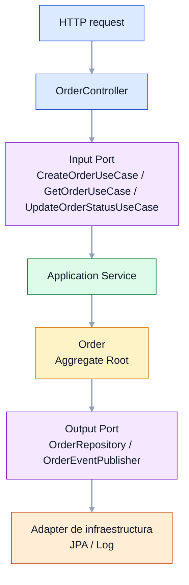
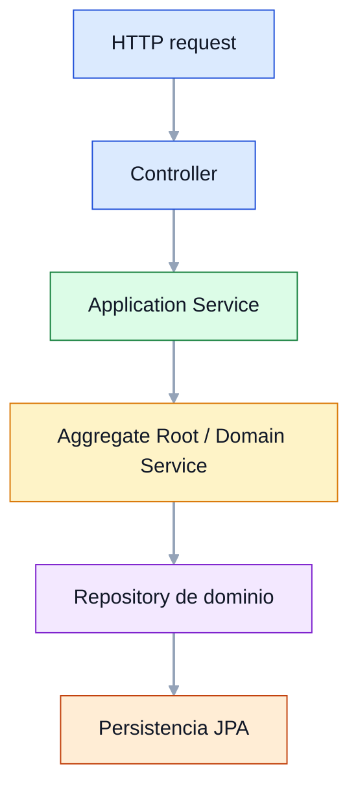
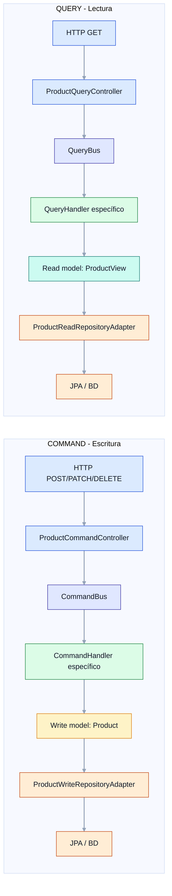
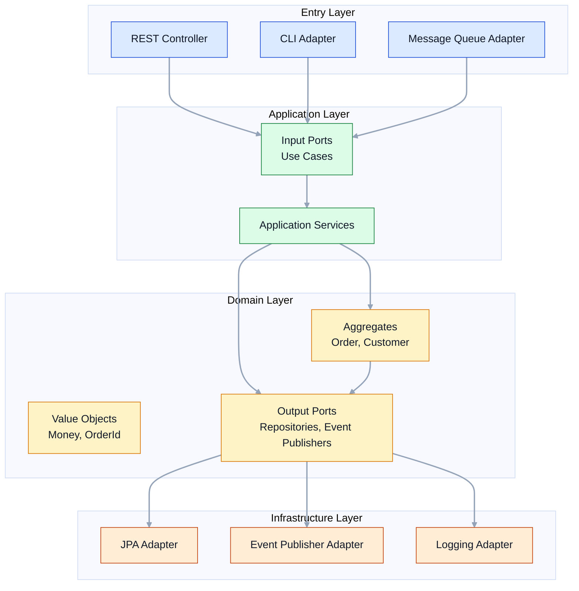
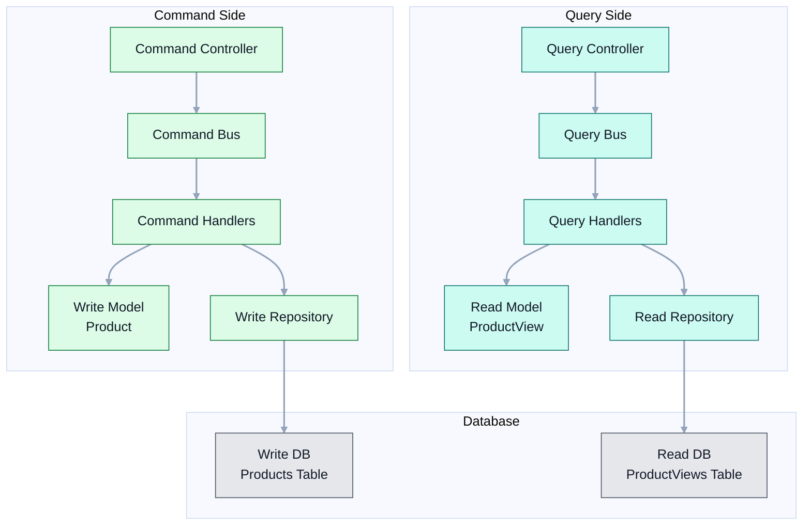
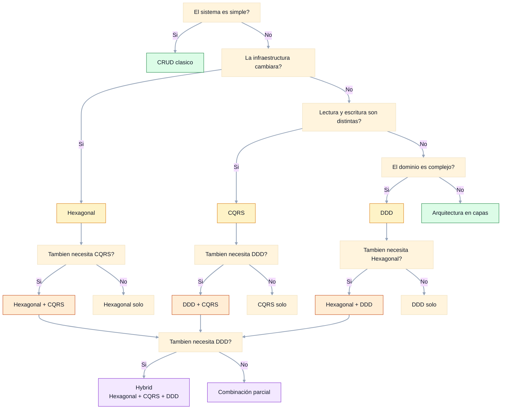
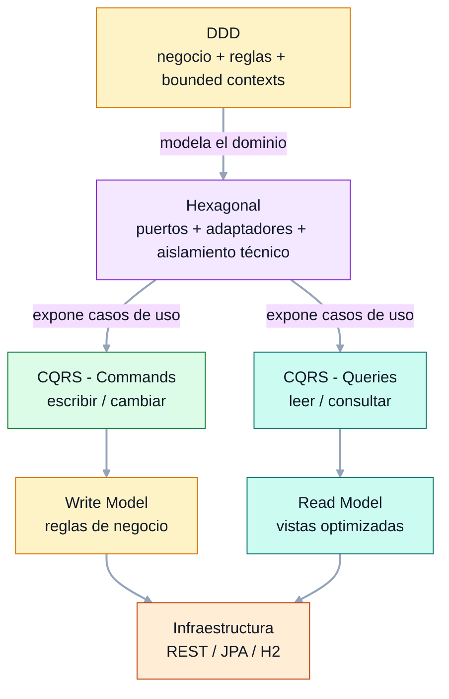

> **Orden de lectura recomendado:** Hexagonal → DDD → CQRS → Hybrid
>
> CQRS utiliza conceptos de DDD (write model rico, factory methods, value objects).
> Si lees CQRS antes que DDD, algunos patrones pueden parecer arbitrarios.
> Empieza siempre por Hexagonal para entender la base, luego DDD para el modelado del dominio,
> y finalmente CQRS para la separación de lectura y escritura.

## Hexagonal Architecture

### Idea principal

La arquitectura hexagonal busca que el **núcleo del sistema** sea el dominio y que todo lo demás sea intercambiable.

El dominio no debería saber si la app usa REST, colas, JPA, MongoDB o Kafka. Para eso existen los **puertos** y **adaptadores**:

- **Puertos de entrada**: lo que el sistema ofrece al exterior.
- **Puertos de salida**: lo que el dominio necesita del mundo externo.
- **Adaptadores**: implementaciones concretas de esos puertos.

### Lo que suele costar entender

1. **El controlador no contiene negocio**
   - Solo traduce HTTP ↔ dominio.
   - No decide reglas de negocio.

2. **Los puertos viven en el dominio**
   - No son “interfaces decorativas”.
   - Representan necesidades reales del negocio.

3. **La infraestructura no manda**
   - JPA, REST, colas, etc. son detalles intercambiables.

4. **La entidad de dominio encapsula reglas**
   - `Order` protege estados válidos.
   - Evita que la aplicación “haga trampas” con el estado.

### Flujo visual



### Pros

- Muy buen aislamiento del dominio.
- Fácil de probar sin Spring ni BD.
- Cambiar tecnología tiene menos impacto.
- Claridad de responsabilidades.

### Contras

- Más clases e interfaces.
- Puede parecer “verbosa” en proyectos pequeños.
- Si se lleva al extremo, añade demasiada ceremonia.

### Cuándo interesa usarla

- Sistemas con lógica de negocio real.
- Proyectos que cambiarán de infraestructura con el tiempo.
- Equipos que quieren separar bien negocio y técnica.
- Aplicaciones donde el dominio debe ser testeable de forma aislada.

### Cuándo no conviene

- CRUDs simples sin reglas relevantes.
- Prototipos desechables.
- Sistemas muy pequeños donde el coste de abstracción supera el beneficio.

## DDD

### Idea principal

DDD no es una arquitectura de capas "bonita"; es una forma de modelar el software alrededor del **lenguaje del negocio**.

En lugar de pensar primero en tablas o endpoints, se piensa en:

- qué quiere hacer el negocio,
- cuáles son sus reglas,
- qué conceptos son importantes,
- y cómo se agrupan.

### Lo que suele costar entender

1. **Bounded Context**
   - Un mismo término puede significar cosas distintas según el contexto.
   - Por eso existen `account` y `customer` como contextos separados.

2. **Aggregate Root**
   - Es el guardián de las invariantes.
   - En este repo, `Account` decide si se puede depositar, retirar o transferir.

3. **Value Objects**
   - No tienen identidad propia, solo valor.
   - `Money`, `AccountId`, `CustomerId` son ejemplos perfectos.

4. **Domain Service**
   - Se usa cuando la lógica no pertenece claramente a un solo aggregate.
   - `TransferDomainService` coordina una transferencia entre cuentas.

5. **Domain Events**
   - Son hechos que ocurrieron en el dominio.
   - Permiten desacoplar reacciones posteriores.

### Flujo visual



### Pros

- Excelente para dominios con reglas complejas.
- Favorece lenguaje común negocio-tecnología.
- Hace visibles los límites del sistema.
- Los invariantes viven donde deben vivir: en el dominio.

### Contras

- Requiere entender bien el negocio.
- Puede parecer sobreingeniería si el dominio es simple.
- No te da automáticamente una solución técnica; exige criterio.
- Si se aplica mal, se convierte en puro "patrón decorativo".

### Cuándo interesa usarlo

- Dominios complejos o cambiantes.
- Sistemas con reglas de negocio importantes.
- Productos donde la comprensión del negocio es clave.
- Equipos que quieren una base robusta y evolutiva.

### Cuándo no conviene

- CRUDs triviales.
- Aplicaciones de poca vida útil.
- Cuando no existe complejidad de negocio real.
- Cuando el equipo aún no puede sostener el coste conceptual.

## CQRS

### Idea principal

CQRS separa **quién escribe** de **quién consulta**.

La idea no es "poner dos carpetas diferentes", sino aceptar que leer y escribir suelen tener necesidades muy distintas:

- Al escribir, importan reglas, validación e invariantes.
- Al leer, importan rapidez, filtros y formatos de consulta.

### Lo que suele costar entender

1. **Command no devuelve datos de lectura**
   - Un command expresa intención de cambio.
   - No debería usarse como query disfrazada.

2. **Read model no tiene por qué ser igual al write model**
   - `Product` protege la escritura.
   - `ProductView` optimiza la consulta.

3. **La separación no es solo conceptual**
   - Aquí hay APIs distintas:
     - `/api/commands/products`
     - `/api/queries/products`

4. **Los buses desacoplan el transporte**
   - `CommandBus` y `QueryBus` evitan que el controlador conozca handlers concretos.

### Flujo visual



### Pros

- Muy claro para sistemas con muchas más lecturas que escrituras.
- Permite optimizar consultas de forma independiente.
- Hace más fácil evolucionar el read model.
- Puede mejorar escalabilidad y rendimiento.

### Contras

- Más complejidad que un CRUD clásico.
- Puede duplicar lógica o estructuras.
- Si el dominio es pequeño, puede sentirse excesivo.
- La consistencia entre escritura y lectura requiere disciplina.

### Cuándo interesa usarlo

- Productos con muchas consultas.
- Paneles, catálogos y dashboards.
- Sistemas donde el modelo de lectura necesita ser distinto del de escritura.
- Dominios donde la carga de lectura y escritura es muy desigual.

### Cuándo no conviene

- CRUDs sencillos.
- Sistemas con reglas de negocio mínimas.
- Equipos que aún no dominan bien la arquitectura base.
- Proyectos donde separar lectura/escritura no aporta un beneficio real.


## Cuándo mezclar arquitecturas

Estas arquitecturas no compiten entre sí; muchas veces se complementan muy bien.

### Hexagonal + DDD

**Cuándo:** casi siempre que el dominio tenga peso real.

**Qué aporta la mezcla:**

- DDD te dice **cómo modelar el negocio**.
- Hexagonal te dice **cómo proteger ese modelo del mundo exterior**.

**Beneficio real en un proyecto:**

- el aggregate no depende de Spring,
- los casos de uso se vuelven explícitos,
- y los adaptadores técnicos quedan fuera del núcleo.

**Resultado típico:** dominio fuerte, infraestructura intercambiable.

### Hexagonal + CQRS

**Cuándo:** cuando escribir y leer empiezan a tener formas muy distintas.

**Qué aporta la mezcla:**

- Hexagonal separa el sistema de los detalles técnicos.
- CQRS separa el comportamiento de escritura del de lectura.

**Beneficio real en un proyecto:**

- puedes tener un write model rico y un read model simple,
- evitar que el controlador conozca la persistencia,
- y optimizar queries sin ensuciar el dominio.

**Resultado típico:** APIs más claras y mejor escalado de lectura.

### DDD + CQRS

**Cuándo:** en dominios complejos donde además hay muchas consultas.

**Qué aporta la mezcla:**

- DDD modela bien la escritura.
- CQRS permite un read model adaptado a cada caso de uso.

**Beneficio real en un proyecto:**

- aggregates pequeños y claros,
- consultas rápidas y específicas,
- posibilidad de evolucionar lectura/escritura por separado.

**Resultado típico:** dominio rico con lecturas muy eficientes.

### Las tres juntas: Hexagonal + DDD + CQRS

**Cuándo:** sistemas serios, con evolución prevista y suficiente complejidad.

**Qué aporta la combinación:**

- **DDD** define el lenguaje y las reglas.
- **Hexagonal** protege el dominio de la tecnología.
- **CQRS** optimiza la experiencia de lectura/escritura.

**Beneficio real en un proyecto:**

- código más mantenible a largo plazo,
- negocio mejor modelado,
- adaptadores intercambiables,
- consultas eficientes,
- y un núcleo de dominio muy testable.

**Pero ojo:** no hay que usar las tres por moda. La combinación solo tiene sentido cuando el problema lo justifica.

## Regla práctica para elegir

- **Si el sistema es pequeño y simple** → probablemente un CRUD bien hecho sea suficiente.
- **Si el dominio importa y la infraestructura puede cambiar** → Hexagonal.
- **Si la escritura y la lectura son claramente distintas** → CQRS.
- **Si hay reglas de negocio complejas y vocabulario del negocio importante** → DDD.
- **Si el sistema es complejo y además necesita lectura optimizada** → combinar Hexagonal + DDD + CQRS.

## APIs de ejemplo

### Hexagonal - Pedidos

```bash
# Crear pedido
curl -X POST http://localhost:8081/api/orders \
  -H "Content-Type: application/json" \
  -d '{"customerId":"CUST-1","items":[{"productId":"P1","productName":"Laptop","price":1200.00,"quantity":2}]}'

# Consultar pedido
curl http://localhost:8081/api/orders/{id}

# Confirmar pedido
curl -X PATCH http://localhost:8081/api/orders/{id}/confirm
```

### CQRS - Productos

```bash
# Crear producto (COMMAND)
curl -X POST http://localhost:8082/api/commands/products \
  -H "Content-Type: application/json" \
  -d '{"name":"MacBook Pro","description":"Laptop Apple","price":2500.00,"stock":10}'

# Listar productos (QUERY)
curl http://localhost:8082/api/queries/products

# Actualizar precio (COMMAND)
curl -X PATCH http://localhost:8082/api/commands/products/{id}/price \
  -H "Content-Type: application/json" \
  -d '{"newPrice":2300.00}'
```

### DDD - Cuentas bancarias

```bash
# Abrir cuenta
curl -X POST http://localhost:8083/api/accounts \
  -H "Content-Type: application/json" \
  -d '{"ownerId":"CUST-1","ownerName":"Alice","initialDeposit":500.00}'

# Depositar dinero
curl -X POST http://localhost:8083/api/accounts/{id}/deposit \
  -H "Content-Type: application/json" \
  -d '{"amount":200.00}'

# Transferir dinero
curl -X POST http://localhost:8083/api/accounts/{fromId}/transfer \
  -H "Content-Type: application/json" \
  -d '{"toAccountId":"{toId}","amount":100.00}'
```

### Hybrid - Suscripciones combinando Hexagonal + CQRS + DDD

```bash
# Crear suscripción (command side)
curl -X POST http://localhost:8084/api/commands/subscriptions \
  -H "Content-Type: application/json" \
  -d '{"customerId":"CUST-1","planCode":"PRO","monthlyFee":29.99}'

# Activar suscripción (command side)
curl -X PATCH http://localhost:8084/api/commands/subscriptions/{subscriptionId}/activate

# Consultar una suscripción (query side)
curl http://localhost:8084/api/queries/subscriptions/{subscriptionId}

# Ver suscripciones activas (query side)
curl http://localhost:8084/api/queries/subscriptions
```

### ¿Qué aporta esta mezcla en un proyecto real?

- El **modelo de negocio** queda limpio y protegido.
- Las **consultas** pueden optimizarse sin tocar la escritura.
- La **infraestructura** puede cambiar con poco impacto en el núcleo.
- Cada parte del sistema tiene una razón clara de existir.

## Diagramas de Arquitectura

### Arquitectura Hexagonal - Componentes



### Arquitectura CQRS - Componentes



### Comparativa de Arquitecturas

| Aspecto | Hexagonal | CQRS | DDD | Hybrid |
|---------|-----------|------|-----|--------|
| **Enfoque principal** | Aislamiento del dominio | Separación lectura/escritura | Lenguaje del negocio | Combinación de las tres |
| **Complejidad** | Media | Media-Alta | Alta | Muy alta |
| **Curva de aprendizaje** | Moderada | Moderada | Alta | Muy alta |
| **Ideal para** | Dominios con infraestructura variable | Sistemas con muchas lecturas | Dominios complejos | Sistemas serios y evolutivos |
| **No ideal para** | CRUDs simples | CRUDs simples | Dominios simples | Prototipos |
| **Componentes clave** | Ports, Adapters, Aggregates | Commands, Queries, Buses | Bounded Contexts, Ubiquitous Language | Todo lo anterior |
| **Testing** | Fácil (dominio aislado) | Fácil (separado) | Fácil (dominio rico) | Fácil pero verboso |
| **Escalabilidad** | Buena | Muy buena (lectura) | Buena | Excelente |

### Diagrama de Decisión



### Diagrama visual de la mezcla




