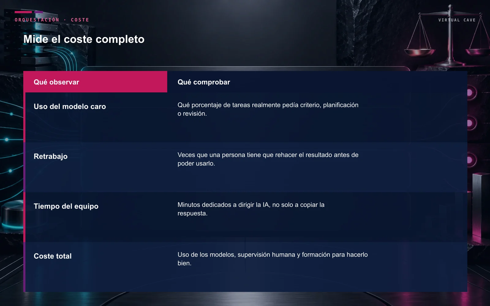

> **Idea de partida:** pedir al modelo más capaz que haga cada tarea es como mandar al senior a clasificar correos.

## El senior que hace el trabajo del junior

Imagina esta situación: una propuesta comercial, un informe interno o una respuesta a un cliente. Alguien abre una herramienta de IA, elige el modelo más potente que tiene a mano y le pide que lo haga todo: buscar, resumir, redactar, corregir y decidir si el resultado se puede enviar.

Nada especialmente raro. En muchas empresas ocurre varias veces al día.

El problema no es usar IA. El problema es tratar todos los encargos como si pidieran el mismo tipo de inteligencia.

En un equipo humano no encargarías a la misma persona preparar el primer borrador, localizar los datos, pasar el filtro de calidad y firmar la decisión. Hay trabajo que pide criterio y trabajo que pide volumen. Mezclarlos en una sola cabeza sale caro, aunque esa cabeza sea muy buena.

Con los modelos de IA ocurre lo mismo.

Antes de preguntar qué herramienta hay que comprar, hay otra pregunta:

¿Qué parte de esta tarea necesita un senior y qué parte puede hacer bien un junior bien dirigido?

## Qué es un agente y qué cambia cuando hay varios

Un modelo de IA, por sí solo, responde a una instrucción. Un **agente** puede encadenar pasos: leer un contexto, usar herramientas, pedir ayuda a otro modelo y devolver un resultado. No todas las tareas necesitan un agente. Un resumen puntual o una clasificación sencilla a menudo se resuelven con una instrucción bien planteada.

La diferencia aparece cuando el trabajo tiene varias partes. Por ejemplo: reunir información, redactar un primer texto, comprobar que no se ha inventado un dato y dejarlo listo para revisión humana.

Ahí entra la **orquestación**: un agente principal reparte el trabajo, espera resultados y decide qué se acepta, qué se rehace y qué se eleva a una persona.

Es el equivalente a un responsable de equipo. No escribe cada párrafo. Decide quién hace qué, con qué margen y cuándo el resultado está listo para salir.

Ese diseño no se improvisa abriendo un chat. Hay que definir qué puede hacer cada agente, qué herramientas tiene permitidas y en qué punto interviene una persona.

## Dos tipos de modelo, dos tipos de empleado

En las herramientas que ya usa tu equipo conviven modelos de distinta capacidad y de distinto coste. La tentación es dejar siempre el más potente. También lo es irse al más barato y esperar el mismo resultado.

Ni una cosa ni la otra.

### El senior: criterio, planificación y revisión

Los modelos de mayor capacidad encajan mejor cuando la tarea pide entender un problema, partirlo en partes, detectar un error de fondo o decidir si un resultado está listo. Son el equivalente a una persona senior: suelen costar más, pero aportan más cuando el trabajo no es mecánico.

Hoy ese papel de criterio lo cubren, según las pruebas de cada equipo, modelos como [Claude Fable 5.1](https://platform.claude.com/docs/en/models/fable-5-1/overview), [Grok 4.6](https://docs.x.ai/developers/grok-4-6) o [GPT-6 Astra](https://developers.openai.com/api/docs/models/gpt-6-astra). No son orquestadores de fábrica. Lo son si el sistema les pide planificar, delegar y revisar.

Tiene sentido reservarlos para:

- definir el plan de una tarea compleja
- revisar el trabajo de otros agentes
- resolver excepciones, ambigüedades o decisiones con impacto comercial
- comprobar coherencia, tono y riesgos antes de que algo salga del equipo

No tiene tanto sentido usarlos para renombrar archivos, extraer una tabla o producir el quinto borrador de un correo estándar.

### El junior: volumen, velocidad y un primer resultado

Los modelos rápidos y eficientes cubren otra parte del trabajo. No sustituyen al criterio. Resuelven a menor coste las tareas repetitivas cuando el objetivo, el formato y los límites están bien definidos.

Encajan mejor en:

- primeros borradores
- resúmenes de material ya disponible
- clasificación de solicitudes
- búsquedas y transformaciones de formato
- piezas concretas dentro de un plan que ya ha marcado el senior

Un junior bien dirigido ahorra tiempo. Un junior sin encargo claro multiplica correcciones. Con los modelos más baratos ocurre exactamente eso. Para ese volumen, un equipo puede asignar [GPT-5.6 Luna](https://developers.openai.com/api/docs/models/gpt-5.6-luna), [Composer 2.5](https://prod.cursor.com/docs/models/cursor-composer-2-5) o [DeepSeek](https://www.deepseek.com/en/news/deepseek-v4-1-flash/) a piezas concretas: resumir, ordenar, extraer. Cada uno con una salida y unas herramientas limitadas.

La analogía no es un ranking de inteligencia. Es una regla de asignación: **reserva la mayor capacidad para planificar y revisar; usa modelos eficientes para ejecutar tareas acotadas bajo supervisión**.

## Cómo se reparte el trabajo, en la práctica

Unamos las ideas en un ejemplo hipotético, no en un caso de cliente.

El equipo comercial necesita una propuesta a partir de una reunión, unos correos y una ficha de servicio. Hoy, una persona lo hace casi todo. O le pide «todo» a un único modelo grande.

En una prueba controlada, Astra orquesta. Luna resume la reunión. Composer 2.5 ordena los correos. DeepSeek extrae los requisitos de la ficha. Fable o Grok podrían ocupar el mismo asiento de orquestador: el sistema es el que les da leer el objetivo, planificar, delegar y revisar.

Las etiquetas senior y junior describen el encargo, no una capacidad fija del modelo.

Una orquestación sencilla podría funcionar así:

**El senior define el encargo.** Astra lee el objetivo, identifica qué información hay, qué falta y cómo debería ser el entregable. No redacta todavía la propuesta completa.

**Los juniors ejecutan piezas.** Luna resume. Composer 2.5 ordena. DeepSeek extrae. Cada uno devuelve solo la pieza acordada, sin inventar condiciones que no estén en el material.

**El senior vuelve a entrar.** Astra compara las piezas con la ficha y con un pequeño conjunto de casos de prueba. Revisa si encajan, si el tono es el adecuado y si hay huecos. Si algo no da el nivel, lo devuelve. Si el resultado está listo para ojos humanos, lo entrega a la persona responsable.

**Una persona cierra.** Condiciones, plazos y compromisos los firma el equipo, no el sistema.

El ahorro aparece en las horas del modelo caro y en las horas de la persona. El modelo grande no ha escrito diez páginas para que luego haya que rehacerlas. Ha dirigido. Los modelos baratos han producido material revisable. La persona no ha empezado de cero.

Ese reparto parece simple descrito en cuatro pasos. En el trabajo real, la dificultad está en otra parte: saber qué tarea merece un senior, qué instrucción necesita un junior para no desviar el resultado, y cuándo hay que parar la automatización. Ahí es donde un equipo sin criterio acaba usando siempre el mismo modelo, o acabando cada encargo a mano.

## Lo que cuesta usar mal la IA

El coste de la IA en una empresa no es solo la factura de uso. Es también el tiempo de quien revisa, corrige y vuelve a pedir el trabajo.

Tres patrones se ven a menudo:

**Todo al modelo más caro.** Cada correo, cada resumen y cada búsqueda pasan por un modelo de alta capacidad. El resultado puede ser correcto y, aun así, estar pagando criterio senior para una tarea junior.

**Todo al modelo más barato.** El equipo ahorra en uso y lo pierde en correcciones, reescrituras y decisiones mal tomadas. Un junior sin supervisión no es un ahorro. Es trabajo a medias.

**Cada persona improvisa.** Una empleada usa siempre el modelo más potente. Un compañero usa el más rápido. Nadie revisa igual. El coste se vuelve imprevisible y la calidad también.

Desde negocio, estas serían cuatro comprobaciones:

Tabla en texto: qué observar y qué comprobar

<table>
<thead>
<tr><th>Qué observar</th><th>Qué comprobar</th></tr>
</thead>
<tbody>
<tr><td>Uso del modelo caro</td><td>Qué porcentaje de tareas realmente pedía criterio, planificación o revisión.</td></tr>
<tr><td>Retrabajo</td><td>Veces que una persona tiene que rehacer el resultado antes de poder usarlo.</td></tr>
<tr><td>Tiempo del equipo</td><td>Minutos dedicados a dirigir la IA, no solo a copiar la respuesta.</td></tr>
<tr><td>Coste total</td><td>Uso de los modelos, supervisión humana y formación para hacerlo bien.</td></tr>
</tbody>
</table>

Una respuesta rápida que exige rehacer el trabajo no cumple el objetivo. Un modelo barato que produce volumen sin control, tampoco.

## El criterio no llega con la herramienta

Dar acceso a varios modelos no convierte a nadie en quien sabe orquestarlos. Del mismo modo que dar acceso a un equipo junior no convierte a cualquiera en un buen responsable.

Hace falta que las personas sepan, en su trabajo concreto:

- cuándo basta un modelo rápido y cuándo hay que subir el encargo
- cómo plantear una tarea para que un agente junior no complete huecos con suposiciones
- qué se puede automatizar y qué debe revisar una persona
- cómo encadenar herramientas sin convertir cada jornada en un experimento

La regla práctica es estrecha. Si el formato está cerrado y el material ya está a mano, el junior basta. Si aparece ambigüedad comercial, un hueco de datos o un riesgo de compromiso, se escala al orquestador y, si hace falta, a una persona.

Eso no se resuelve con un manual genérico ni con una lista de modelos. Se resuelve formando al equipo sobre su flujo real: las propuestas, las consultas, los documentos internos, las revisiones. Qué parte puede hacer un agente y qué parte no.

No hace falta empezar por un sistema complejo. Hace falta que alguien del equipo sepa dirigir el trabajo, igual que se dirige a personas.

## Cierre

Si la respuesta a «quién elige el modelo» es «el que cada persona tenga abierto esa mañana», el coste ya se está decidiendo solo. Empieza por una tarea que hoy hace siempre el mismo modelo y decide qué parte pide criterio y qué parte pide volumen.
